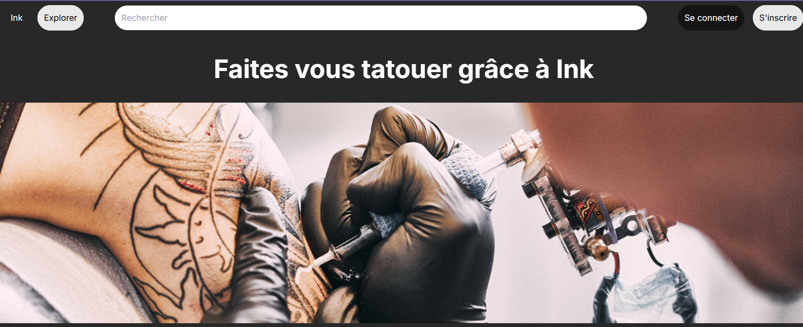

# 🖋️ INK - Trouvez votre tatoueur partout en France

**INK** est un site web conçu comme un réseau social qui permet de trouver un tatoueur en France de manière simple, rapide et efficace. Ce projet est développé avec **Next.js** pour la rapidité et l'efficacité du rendu côté serveur, Tailwind pour le design côté client et utilise **MongoDB** pour stocker les données des utilisateurs et des tatoueurs.



## 🖥️ Aperçu du projet

INK aide les utilisateurs à :
- Trouver des tatoueurs à proximité.
- Découvrir des artistes et des styles variés.
- Se connecter avec les tatoueurs via un modèle de réseau social.

Le site propose des profils de tatoueurs et un fil d'actualités inspirant.

## 🛠️ Fonctionnalités

- **Profils personnalisés** : chaque tatoueur dispose d'un profil complet avec galerie, bio et coordonnées.
- **Intégration MongoDB** : stockage des données utilisateur, tatoueurs, et historique des interactions.
- **Rendu côté serveur** : utilisation des fonctionnalités de Next.js pour un chargement de contenu rapide.

## 📂 Structure du projet

Le projet contient les principaux dossiers suivants :

- `ink/` : contient l'ensemble du projet.
- `components/` : composants réutilisables dans les différentes pages.
- `models/` : modèles de données pour MongoDB.
- `lib/` : configuration de la base de données et autres utilitaires.
- `public/` : ressources statiques, y compris les images et icônes.

## 🚀 Installation et lancement

1. **Clonez le dépôt** :
   ```bash
   cd /ink
   npm i
   npm run dev
   ```